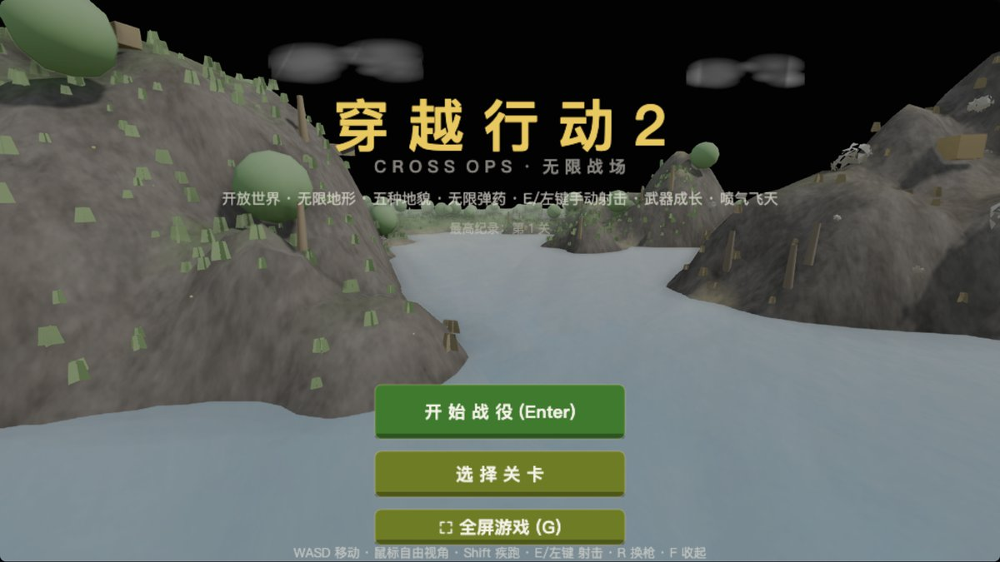
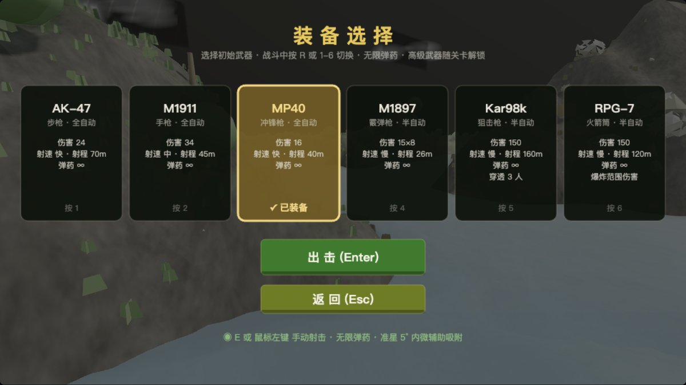
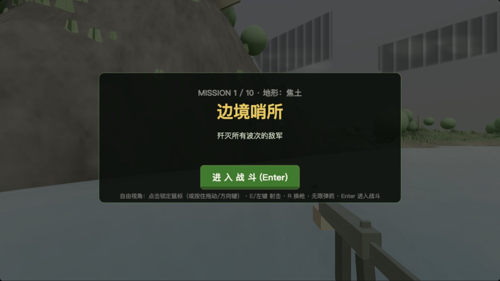
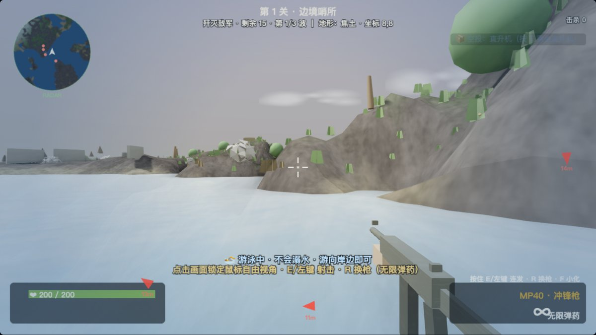
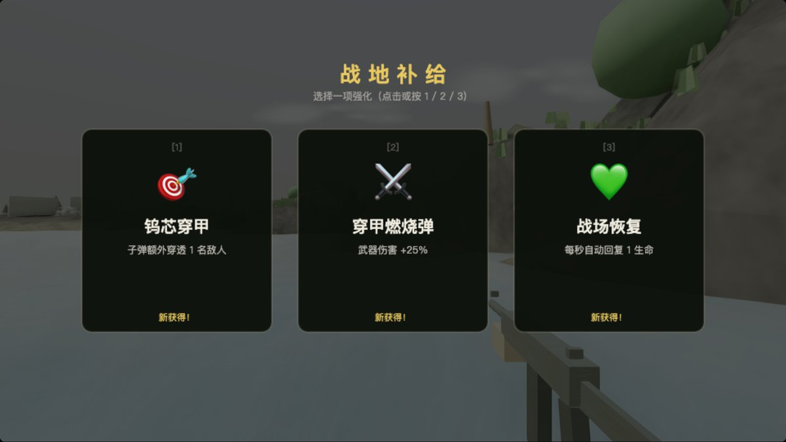
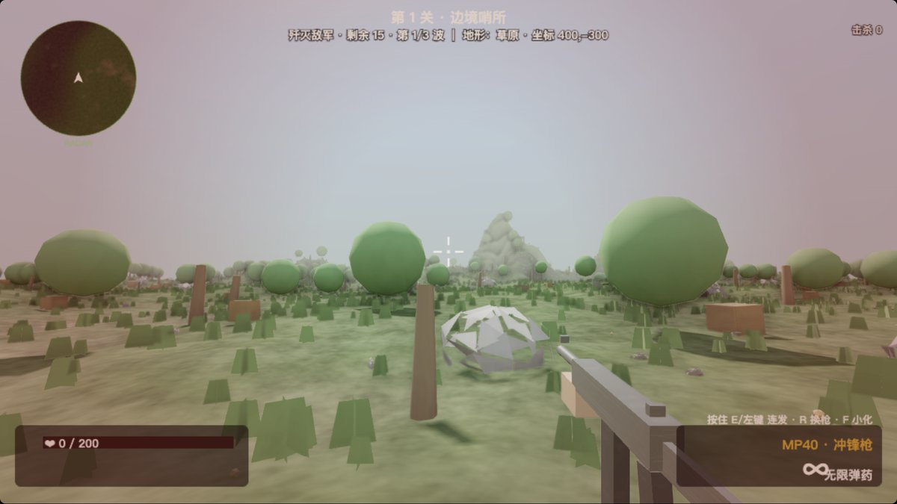

# 穿越行动2 · 无限战场

一款纯前端实现的开放世界第一人称射击游戏。无需安装、无需网络、无任何构建步骤——打开网页就能玩。  index.html用浏览器打开即可开始游戏



## 特性一览

- **无限开放世界**:基于 Simplex 噪声的程序化地形,走到哪儿生成到哪儿,永不重样
- **五种地貌**:草原、森林、沙漠、雪原、焦土,随位置平滑过渡,天空/雾色/光照随地貌联动
- **六种武器**:步枪 / 手枪 / 冲锋枪 / 霰弹枪 / 狙击枪 / 火箭筒,全部无限弹药,随关卡逐步解锁
- **十关战役**:歼灭波次 → 敌后突围 → BOSS 决战三种任务类型循环推进,每关空投到全新战区
- **武器成长**:每关结束三选一强化,共 12 种(伤害、射速、多重射击、穿透、暴击、护甲、喷气背包……)
- **空投福利**:战场上周期空投医疗包、无敌星、分身战友,以及可驾驶的**坦克**和**直升机**
- **水域作战**:游泳泅渡减速、落水医疗包浮在水面;氧气耗尽会溺水持续掉血,上岸快速回氧;敌人入水同样浮面游泳,水中互射弹道与视线判定一致
- **战斗手感**:准星微辅助吸附、暴击、连杀播报、受击方向指示、屏幕震动、浮动伤害数字
- **电影级画面**:SSAO 环境光遮蔽、Bloom 泛光、FXAA 抗锯齿、ACES 电影色调、动态云层与湖面反射
- **自适应画质**:帧率过低时自动关 SSAO → 降分辨率 → 关阴影,低配机器也能流畅跑

## 快速开始

项目是纯静态页面 (index.html 右键-在浏览器中打开)

## 操作指南

| 按键 | 功能 |
|---|---|
| **W A S D** | 移动 |
| **鼠标** | 自由视角(点击画面锁定鼠标,或按住拖动 / 方向键转向) |
| **E / 鼠标左键** | 射击 |
| **Shift** | 疾跑 |
| **SPACE** | 喷气飞天(需拾取"喷气背包"强化) |
| **1 - 6** | 切换武器(需已解锁) |
| **R** | 循环切换已拥有武器 |
| **T** | 乘坐 / 离开载具(坦克、直升机) |
| **P** | 暂停 / 继续 |
| **G** | 全屏开关 |
| **F** | 一键收起(全屏时退出全屏,平时暂停并收起画面) |
| **M** | 静音开关 |

## 游戏流程

1. **装备选择** —— 每局挑选初始武器出击,高级武器随关卡进度解锁
2. **任务简报** —— 查看本关地形与目标,Enter 进入战斗
3. **战斗** —— 歼灭波次敌军 / 达标击杀后激活绿色信标突围撤离 / 击败 BOSS
4. **战地补给** —— 过关后三选一强化,武器与强化永久保留,阵亡不清档
5. **下一关** —— 空投到 700 米外的全新战区,敌人更强,直到打穿第 10 关











## 武器与敌人

**武器**(全部无限弹药):

| 槽位 | 武器 | 类型 | 解锁 |
|---|---|---|---|
| 1 | AK-47 | 步枪 · 全自动 | 第 1 关 |
| 2 | M1911 | 手枪 · 全自动 | 第 1 关 |
| 3 | MP40 | 冲锋枪 · 全自动 | 第 3 关 |
| 4 | M1897 | 霰弹枪 · 8 弹丸 | 第 4 关 |
| 5 | Kar98k | 狙击枪 · 穿透 3 人 | 第 5 关 |
| 6 | RPG-7 | 火箭筒 · 范围爆炸 | 第 7 关 |

**敌人**:步兵(近战追击)、枪手(远程压制)、重装兵(高血量),以及第 5 / 10 关的两个 BOSS(冲锋 + 扇形弹幕)。敌人有警戒系统——出生时在岗哨巡逻,发现你或听到枪声才一拥而上,善用地形潜入先手。

## 空投福利

每隔 20~30 秒战场会投下福利包(降落伞下落,带彩色光柱标记):

- ❤ **医疗包**:+80 生命
- ★ **无敌星**:无敌 3 秒
- 👥 **分身器**:召唤并肩作战的战友 60 秒
- 🚗 **坦克**:800 耐久,E 发射爆炸炮弹,行驶可直接碾压敌军
- ✈ **直升机**:自动升空 12 米,E 速射机炮对地打击

## 技术实现

- **渲染**:Three.js r128 + 官方后期处理套件(EffectComposer / SSAO / UnrealBloom / FXAA)
- **地形**:Simplex 噪声分层生成高度场,按地貌混合顶点色,无限区块流式加载
- **纹理**:全部程序化生成(Canvas 绘制无缝平铺细节贴图、法线贴图、辉光贴图、云贴图)
- **音效**:WebAudio 实时合成(枪声、爆炸、UI、连杀音阶),零音频文件
- **模型**:代码内联几何体拼装(士兵骨骼动画、坦克、直升机、空投箱)
- **零依赖**:除 three.min.js 外无任何外部资源,离线可玩,总大小不到 1 MB

```
game1/
├── index.html          # 入口(脚本加载顺序即模块依赖顺序)
├── three.min.js        # Three.js r128
├── css/style.css       # 页面样式
├── js/
│   ├── core.js         # 画布与尺寸适配
│   ├── utils.js        # 数学 / 随机 / 噪声 / 程序化贴图工厂
│   ├── audio.js        # WebAudio 合成音效
│   ├── guns.js         # 武器与强化数据表
│   ├── state.js        # 全局状态与通用助手
│   ├── world.js        # 地貌定义 / 地形高度 / 地面颜色
│   ├── scene.js        # 渲染器 / 相机 / 光照 / 天空 / 水面 / 后期管线
│   ├── terrain.js      # 无限区块网格与植被散布
│   ├── models.js       # 士兵 / 武器 / 视图模型拼装
│   ├── fx.js           # 粒子 / 曳光 / 爆炸 / 飘字
│   ├── drops.js        # 空投 / 增益 / 分身 / 载具
│   ├── levels.js       # 关卡定义与流程状态机
│   ├── enemy.js        # 敌人生成与 AI
│   ├── combat.js       # 射击 / 伤害 / 爆炸判定
│   ├── player.js       # 玩家移动 / 视角 / 相机
│   ├── input.js        # 键鼠输入与按键路由
│   ├── hud.js          # 战斗 HUD 绘制
│   ├── ui.js           # 菜单界面绘制
│   ├── main.js         # 主循环与自适应画质
│   └── vendor/         # Three.js 官方后期处理组件
└── screenshots/        # README 配图
```

## 环境要求

任何支持 WebGL 的现代浏览器(Chrome / Edge / Firefox / Safari)。无服务端、无数据库、无构建工具,断网也能玩。
